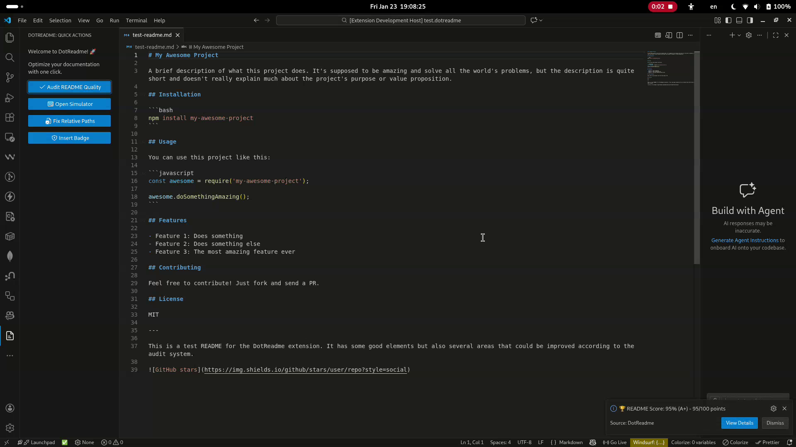
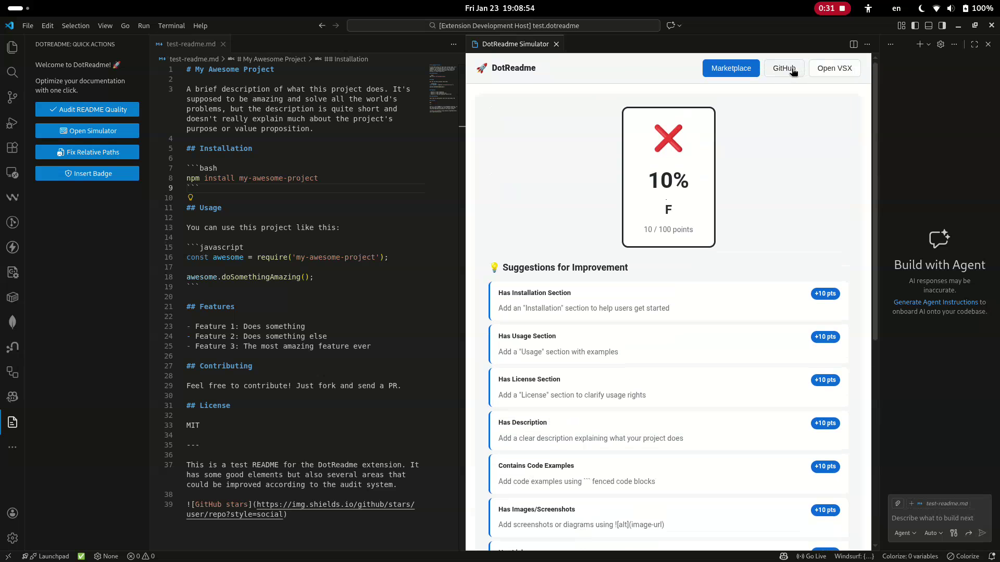
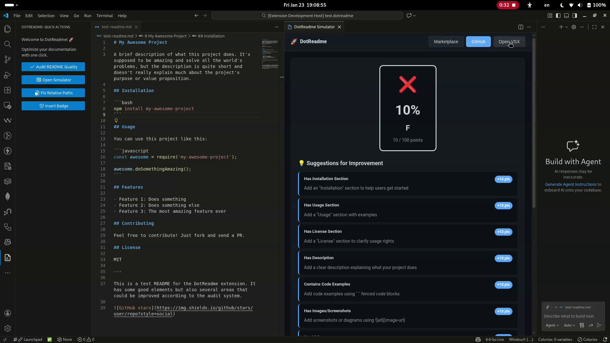
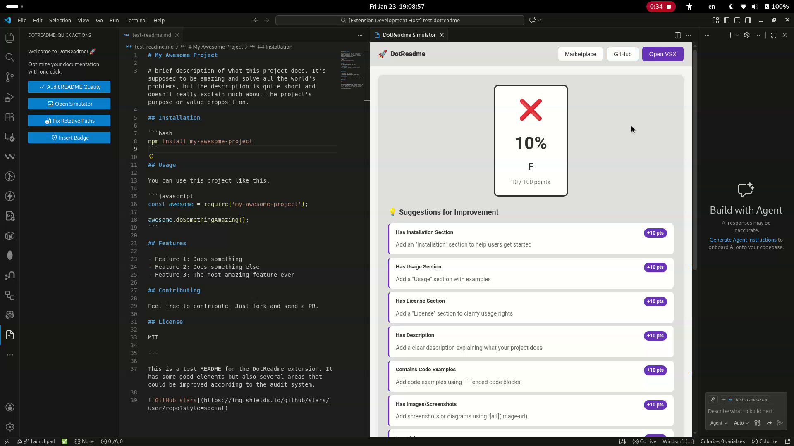

  
  <h1>DotReadme</h1>
  
<strong>The Ultimate README Optimizer for VS Code</strong>

  

    Write confident documentation. Simulate, Audit, Fix, and now <strong>AI-enhance</strong> your README 
    for <strong>GitHub</strong>, <strong>VS Code Marketplace</strong>, and <strong>Open VSX</strong> instantly.
  

  

    
    
    
  

   

  

---

## 🚀 Why DotReadme?

Creating a perfect README is hard. You write Markdown, push to GitHub, and realize the images are broken, the styling is off, or you missed important sections.

**DotReadme** fixes this workflow. It lives right inside VS Code and acts as your personal documentation assistant — now powered by AI.

## ✨ Features

### 1. 🎭 Real-time Simulator
Preview your README exactly as it appears on popular platforms. No more "push and pray".
* **VS Code Marketplace Mode:** Perfect for extension developers.
* **GitHub Mode:** See how it looks on repositories.
* **Open VSX Mode:** For open-source registry compatibility.

### 2. 📊 Instant Quality Audit
Get a **Live Health Score (A+ to F)** for your documentation.
* Checks for missing sections (Installation, Usage, License).
* Verifies broken links and images.
* Suggests best practices to improve readability.

### 3. 🛠️ One-Click Path Fixer
Broken images on the Marketplace? Never again.
* Automatically detects your GitHub repository.
* Converts local paths (`./images/logo.png`) to absolute raw URLs.
* Ensures your images load everywhere.

### 4. 🛡️ Smart Badge Inserter
Add professional shields to your README in seconds.
* License, Version, Downloads, CI/CD Status.
* Auto-detects your repo info to generate the correct links.

### 5. 🤖 AI-Powered Enhancement ✨ New in v1.1.0
Let AI improve your documentation with a single right-click.
* **Rewrite for Clarity** — Makes any section simpler and easier to understand.
* **Rewrite for Tone** — Choose between Professional, Concise, or Clear & Simple.
* **Generate Missing Section** — Picks up your project context and writes Installation, Usage, FAQ, and more.
* Supports **Anthropic Claude**, **OpenAI GPT**, and **Google Gemini** (BYOK).

### 6. 📋 TOC Generator ✨ New in v1.1.0
Generate and auto-update a Table of Contents in one click.
* Detects all `##` and `###` headings automatically.
* Re-running the command **updates** the existing TOC in place — no duplicates.
* Skips headings inside code blocks.

---

## 📸 Screenshots

| **Quality Audit System** | **Marketplace Preview** |
|:---:|:---:|
|  |  |

| **GitHub Theme** | **Open VSX Theme** |
|:---:|:---:|
|  |  |

---

## 📦 Usage

### Quick Actions (Sidebar)
Click the **DotReadme** icon in the Activity Bar to access quick commands:
* `Open Simulator`
* `Fix Relative Paths`
* `Insert Badge`
* `Generate TOC`
* `DotReadme AI`

### Command Palette
Press `Ctrl+Shift+P` (or `Cmd+Shift+P` on Mac) and type `DotReadme`:

1. **Open Simulator** — Launches the live preview panel.
2. **Audit README Quality** — Shows a score notification with a detailed report.
3. **Fix Relative Paths** — Rewrites local links to GitHub raw URLs.
4. **Insert Badge** — Opens a picker to add status shields.
5. **Generate Table of Contents** — Inserts or updates a TOC from your headings.
6. **✨ Rewrite for Clarity** — AI rewrites the selected text for clarity *(select text first)*.
7. **🎯 Rewrite for Tone** — AI rewrites with a chosen tone *(select text first)*.
8. **🤖 Generate Missing Section** — AI generates a full README section at cursor.

### Right-Click Context Menu
Right-click inside any `.md` file to access the **✨ DotReadme AI** submenu directly.

---

## ⚙️ Requirements

* VS Code `^1.90.0` or higher.
* An active Internet connection (for badges, simulator styles, and AI features).
* An API key for AI features — add yours in Settings under `DotReadme`.

## 🔑 AI Setup (BYOK)

DotReadme uses a **Bring Your Own Key** model. Your keys are stored securely in VS Code's secret storage and never leave your machine.

1. Open **Settings** (`Ctrl+,`) and search for `DotReadme`.
2. Choose your provider: `anthropic`, `openai`, or `gemini`.
3. Paste your API key in the corresponding field.

| Provider | Where to get a key |
|---|---|
| Anthropic Claude | [console.anthropic.com](https://console.anthropic.com) |
| OpenAI GPT | [platform.openai.com](https://platform.openai.com) |
| Google Gemini | [aistudio.google.com](https://aistudio.google.com/app/apikey) |

---

## 🤝 Contributing

Found a bug? Have a feature request? We love community feedback!
Please open an issue on our [GitHub Repository](https://github.com/kareem2099/DotReadme).

## ❤️ Support

**DotReadme** is an open-source project built with love. If this tool saved you time or improved your workflow, please consider supporting the development!

Your support helps keep the project alive, ad-free, and constantly evolving.

  

   

  <h3>
    <a href="https://github.com/sponsors/kareem2099">💖 GitHub Sponsors</a> &nbsp;|&nbsp;
    <a href="https://ko-fi.com/freerave">☕ Ko-fi</a> &nbsp;|&nbsp;
    <a href="https://paypal.me/freerave1">🅿️ PayPal</a>
  </h3>

---

## 📄 License

This project is licensed under the [MIT License](LICENSE).

---

  Built with ❤️ by <a href="https://github.com/kareem2099">FreeRave</a>

